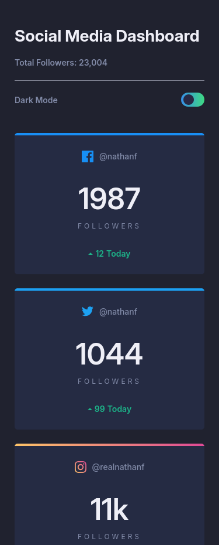
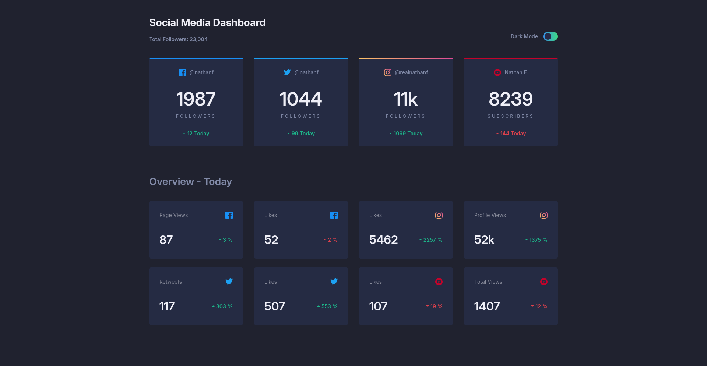

# Frontend Mentor - Social media dashboard with theme switcher solution

This is a solution to the [Social media dashboard with theme switcher challenge on Frontend Mentor](https://www.frontendmentor.io/challenges/social-media-dashboard-with-theme-switcher-6oY8ozp_H). Frontend Mentor challenges help you improve your coding skills by building realistic projects.

## Table of contents

- [Overview](#overview)
  - [The challenge](#the-challenge)
  - [Screenshot](#screenshot)
  - [Links](#links)
- [My process](#my-process)
  - [Built with](#built-with)
  - [What I learned](#what-i-learned)
  - [Continued development](#continued-development)
  - [Useful resources](#useful-resources)
- [Author](#author)
- [Daily summaries](#daily-summaries)

## Overview

### The challenge

Users should be able to:

- View the optimal layout for the site depending on their device's screen size
- See hover states for all interactive elements on the page
- Toggle color theme to their preference

### Screenshot

### Links

- Github Pages URL: [https://florianstancioiu.github.io/social-media-dashboard-with-theme-switcher/](https://florianstancioiu.github.io/social-media-dashboard-with-theme-switcher/)
- Frontend Mentor URL: [https://www.frontendmentor.io/solutions/social-media-dashboard-with-vanilla-javascript-and-css-nesting-wbpU9uEfs9](https://www.frontendmentor.io/solutions/social-media-dashboard-with-vanilla-javascript-and-css-nesting-wbpU9uEfs9)

## My process

### Built with

- Semantic HTML5 markup
- CSS nesting
- CSS variables
- Flexbox
- CSS Grid
- Mobile-first workflow
- Vanilla JavaScript

### What I learned

- CSS borders don't support linear gradients

### Continued development

- I would like to convert the project to vanilla web components, so that I can learn them thoroughly

### Useful resources

- [Document: importNode() method](https://developer.mozilla.org/en-US/docs/Web/API/Document/importNode) - This method helped me create a clone of the template tag
- [A Modern CSS Reset](https://www.joshwcomeau.com/css/custom-css-reset/) - This is a CSS reset
- [JavaScript modules](https://developer.mozilla.org/en-US/docs/Web/JavaScript/Guide/Modules) - This helped me isolate code from one file to another
- [Element: setAttribute() method](https://developer.mozilla.org/en-US/docs/Web/API/Element/setAttribute) - This helped me set the correct image icons

## Author

- Frontend Mentor - [@florianstancioiu](https://www.frontendmentor.io/profile/florianstancioiu)
- Threads - [@florianstancioiu01](https://www.threads.com/@florianstancioiu01)
- LinkedIn - [florianstancioiu](https://www.linkedin.com/in/florian-stancioiu-765661349/)
- freeCodeCamp - [florianstancioiu](https://www.freecodecamp.org/florianstancioiu)

## Daily summaries

| Date               | Time Spent | Summary                                                                                                    |
| ------------------ | ---------- | ---------------------------------------------------------------------------------------------------------- |
| February 8th, 2026 | 4.5 hours  | I implemented the project using vanilla JavaScript and vanilla CSS (there are some incomplete tasks items) |
| February 8th, 2026 | 0.5 hours  | I refactored the js followers code                                                                         |
| February 8th, 2026 | 1 hour     | I Used linear gradients & I updated the color of percentages based on ASC, DESC orders from data.json      |

_Total time spent working on the project:_ **6 hours**
